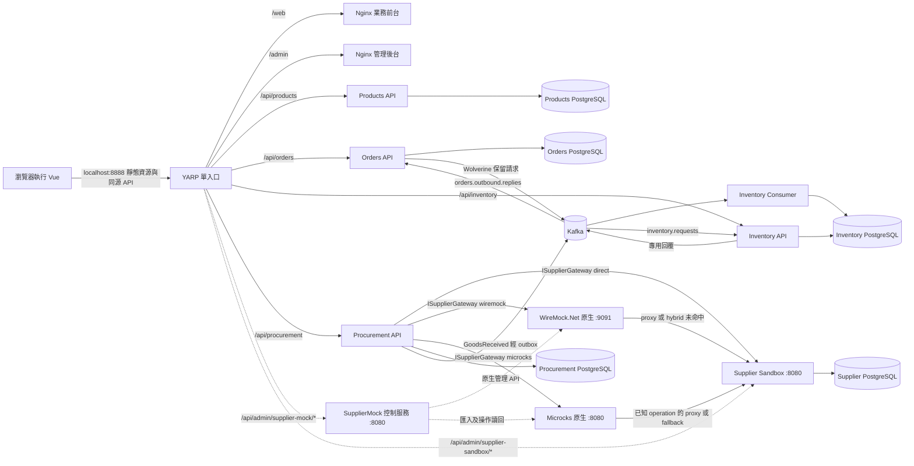

# 實驗室部署與責任邊界

下圖對應五份 Compose 檔案合成後的 `frontend-lab`、`procurement-lab` 部署。實線箭頭是一般業務資料，虛線是操作員控制或狀態查詢。對資料庫與 Kafka 的箭頭表示服務責任，不表示瀏覽器能直接連線。

YARP 的 frontend overlay 讓 `/web`、`/admin` 保留前綴進入各自 Nginx；兩個 Nginx 提供 SPA 與靜態檔。Vue 程式在瀏覽器執行，再由瀏覽器經同源 YARP 呼叫 API；Nginx 不代理業務請求。YARP 的四組 `/api/...` 業務路由不進 SPA fallback。管理路由只移除 `/api/admin/supplier-mock` 或 `/api/admin/supplier-sandbox` 前綴，讓後端仍看到 `/control/*` 或 `/sandbox/*`。前端容器只在 Docker 網路暴露 80；主機公開的 YARP port 是 `127.0.0.1:8888`。既有採購操作手冊也提供 8180–8185 的本機直連端點，適合拆開檢查，不等於公開部署入口。

## 資料面與控制面

資料面由 `Procurement → ISupplierGateway → HttpSupplierGateway → 固定 provider URL` 組成。`direct` 到 sandbox，`wiremock` 到原生 WireMock 9091，`microcks` 到 `/rest/Supplier+API/1.0.0/`。三者都使用相同的報價、建單、以 `clientRequestId` 查單業務契約。前台選 provider 是建立採購身分的一部分；在管理後台切換某引擎模式，不會更改已建立採購的 provider，也不會讓 `direct` 繞經該引擎。

控制面由管理後台、`SupplierMock.WebApi` 的 `/control/*` 及 sandbox 的 `/sandbox/*` 組成。WireMock 控制器以原生 `__admin/mappings` 和 `__admin/requests` 重建及讀取映射；Microcks 控制器上傳固定 YAML，查原生 `/api/services` 的三個 operation／dispatcher/rules，必要時只校正這三個已知 operation。`ready` 是原生設定讀回結果；仍需送唯一 HTTP 請求來確認資料面。sandbox 的最近請求與訂單由 sandbox 自己持久／即時觀察；其延遲設定只在程序生命週期內有效。

四個業務邊界有自己的持久資料：Products、Orders、Procurement、Inventory；Supplier Sandbox 再有獨立的供應商資料庫。採購 `Accepted` 只表示供應商接單；實際 `ReceiptId` 登錄時，Procurement 在同一 PostgreSQL 交易保存收貨與 source outbox，relay 交接 Wolverine durable outbox 後由 Kafka 送達，Inventory Consumer 再以相同 `ReceiptId` 做一次性入庫。Inventory 的 receipt、stock 與自身 outbox 在單一交易完成。銷售的 Orders 另以 Wolverine/Kafka 請求／回覆向 Inventory 要求保留庫存，沒有呼叫供應商 mock。採購與銷售不能合併畫成一條同步交易。

## 目前部署假設

- `WireMock.Net` 2.15.0 內嵌於 `SupplierMock.WebApi`；8182 是自製控制頁，8183 才是原生資料／管理端點。固定上游是 `supplier-sandbox:8080`。
- `microcks-uber:1.15.0` 在 Compose 中未掛資料 volume。重啟／重建後重新檢查 `Supplier API` 是否已匯入；不能把曾經的 `ready` 當成現在的模式。
- 8180–8185 與 8888 均綁本機 `127.0.0.1`。這個實驗室沒有新增登入或角色控制；不適用於公開網路。
- F: RAM disk 的 worktree 可供建置來源，但 Docker Desktop 執行期 bind mount 可能失敗；實際部署請依 [前台手冊](../../operations/commerce-frontend.md) 在持久路徑操作並核對 Compose `ps`。

圖上的關係依 [來源](sources.md) 的 Compose、YARP route、應用埠及持久化實作核對；部署當下的容器與資料狀態須另行讀回。
