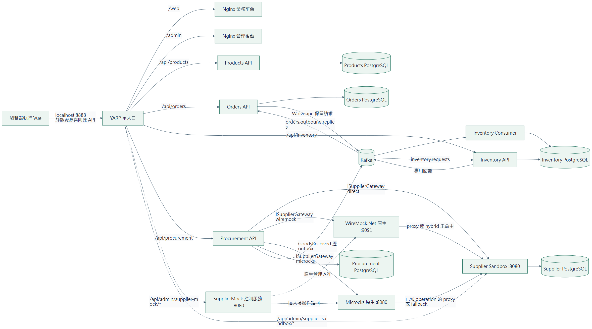
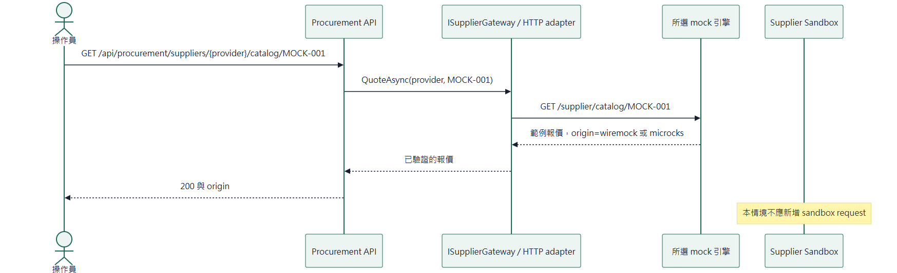
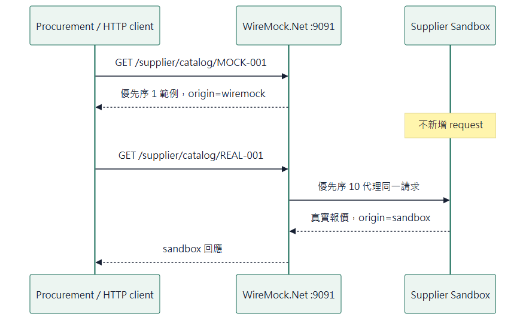
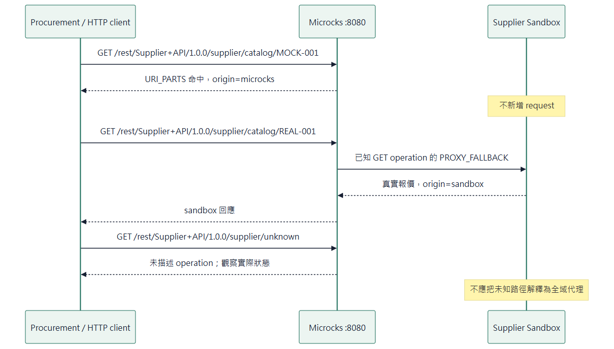
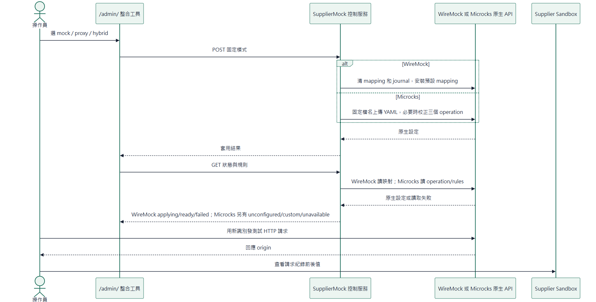
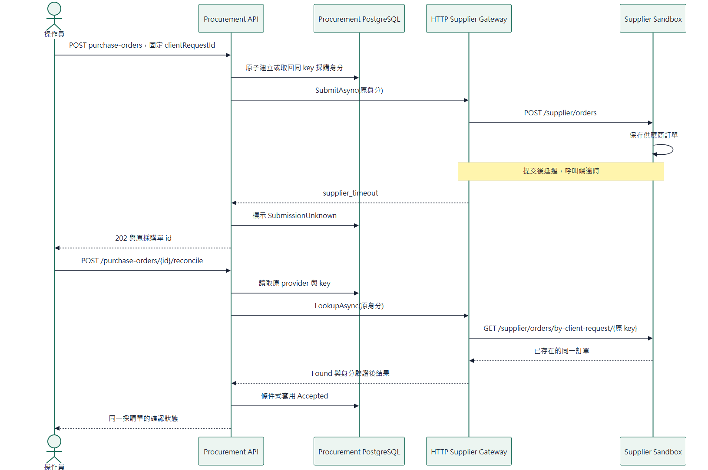
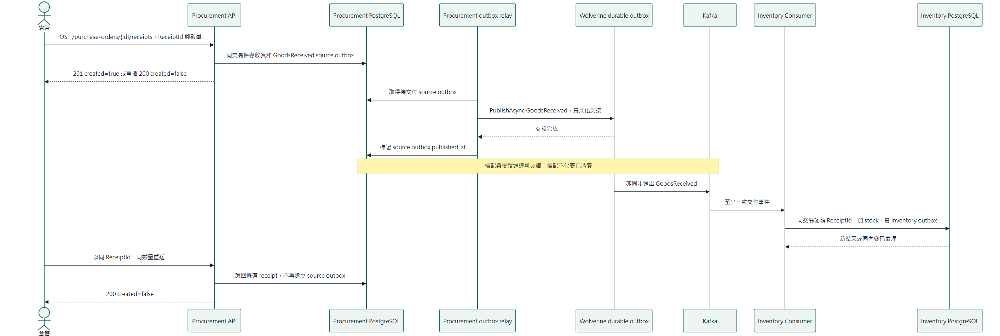
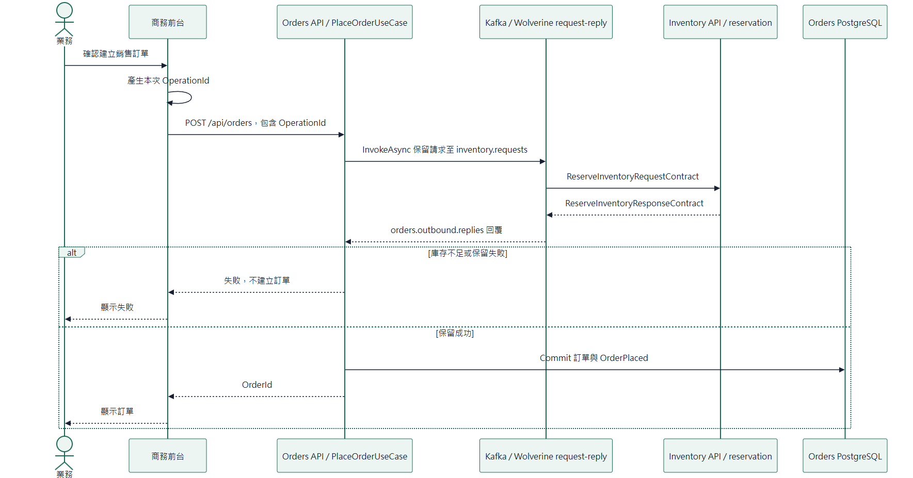

# 架構與時序圖檔

本目錄由 [架構](../architecture.md) 與 [時序圖](../sequences.md) 的 Mermaid 區塊產生。維護時先修改 Markdown，再重新渲染，勿只修改衍生圖檔。

提供 SVG（縮放／列印）、PNG（貼入文件）與 MMD（Mermaid 原始碼）。[離線圖庫](index.html) 可用瀏覽器開啟，點圖可查看完整大小。圖庫與圖檔保留在同一個目錄即可離線使用。

渲染版本：Mermaid 11.12.0。圖形描述程式責任與預期互動，沒有把它當成實際執行的驗收證據。

## 實驗室部署與責任邊界

[SVG](architecture-01.svg) · [PNG](architecture-01.png) · [Mermaid](architecture-01.mmd)

## 1. 僅模擬：固定範例沒有進上游

[SVG](sequences-01.svg) · [PNG](sequences-01.png) · [Mermaid](sequences-01.mmd)

## 2. WireMock hybrid：高優先序範例與廣域代理

[SVG](sequences-02.svg) · [PNG](sequences-02.png) · [Mermaid](sequences-02.mmd)

## 3. Microcks hybrid：已知 operation 的範例與 fallback

[SVG](sequences-03.svg) · [PNG](sequences-03.png) · [Mermaid](sequences-03.mmd)

## 4. 模式切換與讀回：控制成功不等於流量正確

[SVG](sequences-04.svg) · [PNG](sequences-04.png) · [Mermaid](sequences-04.mmd)

## 5. 供應商已提交、呼叫端逾時：保留原 key 協調

[SVG](sequences-05.svg) · [PNG](sequences-05.png) · [Mermaid](sequences-05.mmd)

## 6. 實際收貨才入庫：兩端各自保證冪等

[SVG](sequences-06.svg) · [PNG](sequences-06.png) · [Mermaid](sequences-06.mmd)

## 7. 銷售訂單另走庫存保留

[SVG](sequences-07.svg) · [PNG](sequences-07.png) · [Mermaid](sequences-07.mmd)

