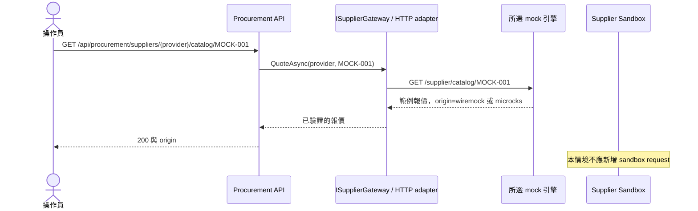
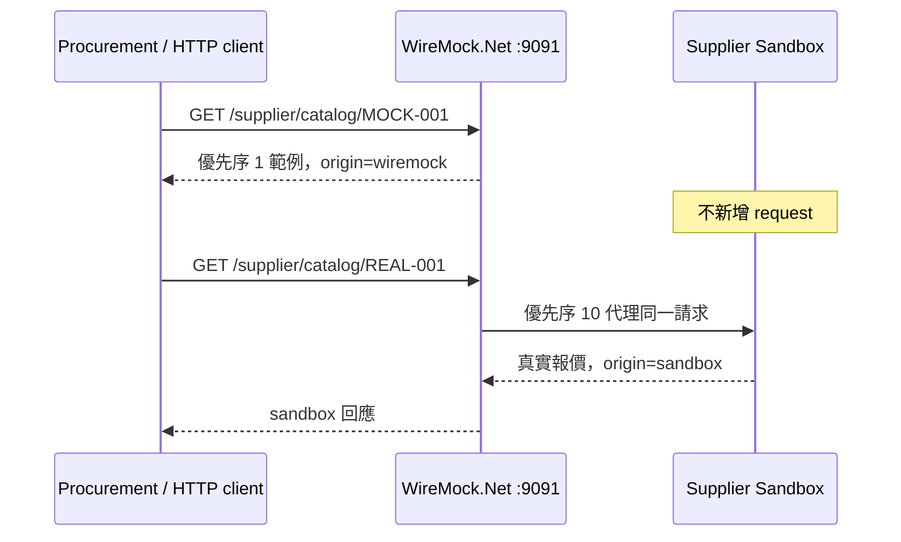
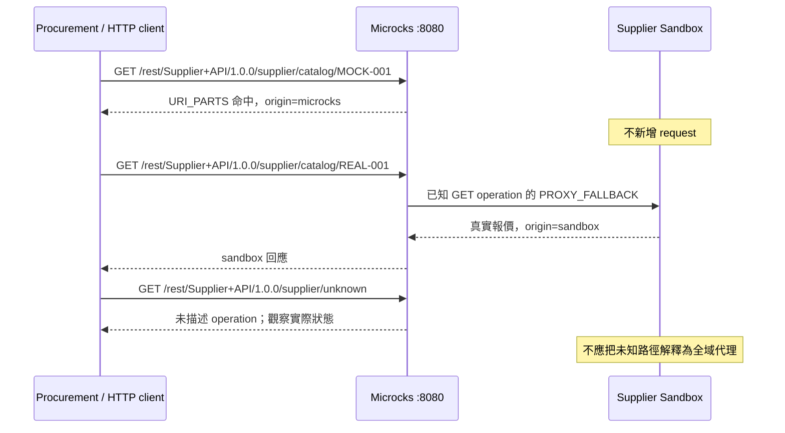
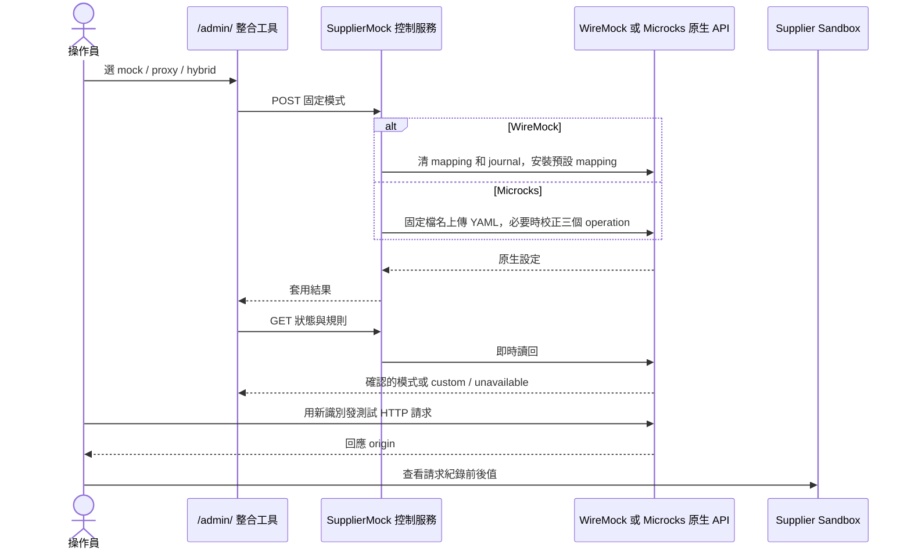
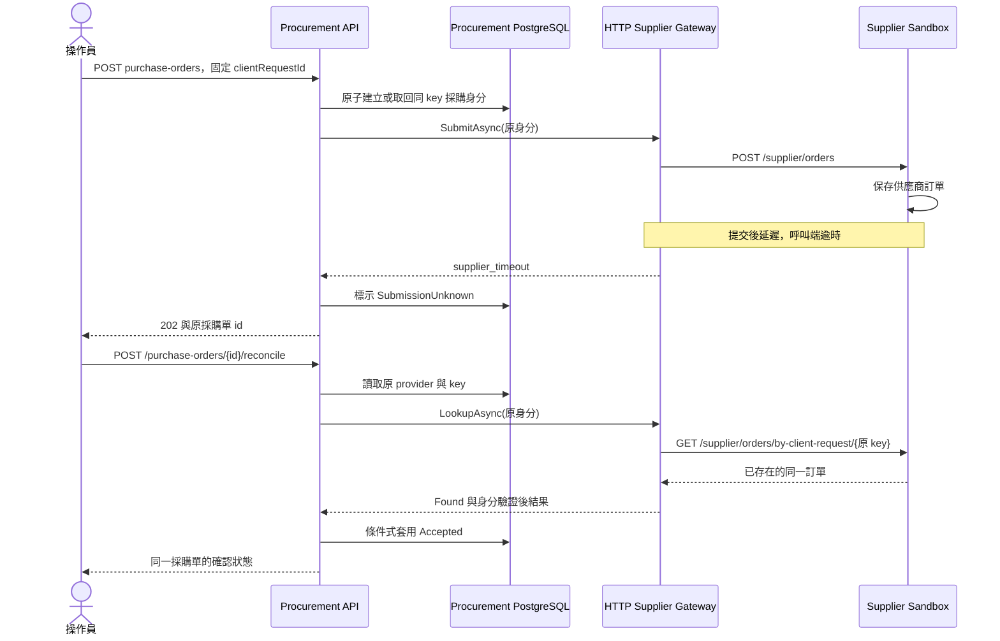
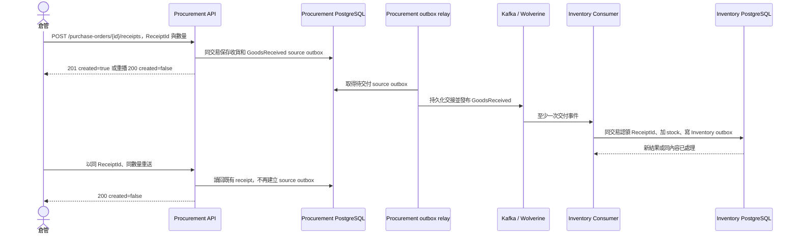
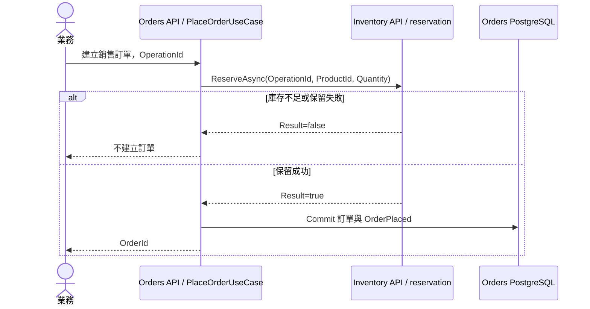

# 供應商替身與商務流程時序

以下是依目前程式和設定整理的**預期資料流**，不是一次實際執行的錄影或驗收紀錄。先選定 provider 和引擎模式，再用回應 `origin`、引擎紀錄及 sandbox request journal 交叉比對。圖中省略無關的 HTTP 包裝與 UI 輪詢。各圖的路徑和可觀察欄位見 [展示指南](demo-guide.md)。

## 1. 僅模擬：固定範例沒有進上游

`wiremock` 和 `microcks` 是互斥的 provider 選項；圖中 `Mock engine` 代表所選的一套。WireMock mock 模式只裝固定範例 mapping；Microcks mock 契約僅為三個已知 operation 提供範例。`MOCK-001` 報價可直接示範；若示範 POST，必須使用固定完整本文，不能把任意新單當作範例命中。

## 2. WireMock hybrid：高優先序範例與廣域代理

控制器先安裝優先序 1 的固定 GET/POST mapping，再裝優先序 10 的 `/*` 原生 proxy mapping。`MOCK-001` 的 GET 命中 stub；`REAL-001` 未命中該 stub，故流向固定 sandbox。此處的 `/*` 範圍比 Microcks 的契約 operation 更廣。

## 3. Microcks hybrid：已知 operation 的範例與 fallback

匯入 `supplier-hybrid.yaml` 後，`Supplier API` 1.0.0 只有 catalog GET、orders POST、by-client-request GET 三個 operation。各自使用 `PROXY_FALLBACK`：先以 URI 部分或 JS 本文規則找範例，未命中**該已知 operation 的範例**時才代理。`/supplier/unknown` 沒有 operation，不能宣稱會走 fallback。

## 4. 模式切換與讀回：控制成功不等於流量正確

管理後台的 WireMock 操作送到自製 `/control/mode`，控制器重建原生 mapping 並清除 journal；Microcks 操作送到 `/control/microcks/mode`，控制器匯入固定 YAML 並確認三個原生 operation。兩者須再次讀回狀態；之後再發唯一測試請求核對資料路徑。

## 5. 供應商已提交、呼叫端逾時：保留原 key 協調

在 sandbox 把 `delayAfterCommitMs` 設為受控值時，可讓供應商持久化訂單後才延遲回應。Procurement 先在本地保存唯一 `clientRequestId`，送單只有一次 HTTP POST；逾時標記 `SubmissionUnknown`。依原本採購單 `id` 呼叫 reconcile，系統使用同一 provider 和同一 `clientRequestId` 查供應商，不產生新採購身分。查不到或通訊不確定仍保持未知狀態，不能當拒絕。

## 6. 實際收貨才入庫：兩端各自保證冪等

收貨與 Procurement source outbox 同交易；relay 的 `published_at` 只代表持久化傳輸交接，不代表 Kafka 已消費。Inventory Consumer 以 `ReceiptId` 執行庫存端收貨；Inventory PostgreSQL 同交易保存 receipt、增加 stock 並寫 Inventory outbox。重送相同 ID 與相同內容讀回既有結果；不同內容必須衝突。

## 7. 銷售訂單另走庫存保留

銷售不是供應商採購。Orders 在建立銷售訂單前向 Inventory 要求保留，保留失敗便不提交訂單；成功後 Orders 保存訂單與自己的 `OrderPlaced` 來源事件。此圖只描述目前同步保留的責任順序，沒有聲稱銷售與採購共享交易。

