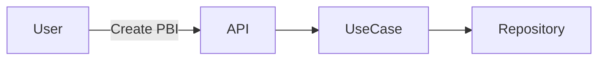

# Requirement Guide

本文件定義需求文件的標準格式與撰寫規範。所有需求文件**建議以單一檔案完整表達**，必要圖表使用 **Mermaid** 直接嵌入。

## 1) File Naming
- 使用清楚的領域名稱（英文小寫 + 連字號）
- 例：`product-backlog-design-analysis.md`

## 2) Required Sections

### 2.1 Metadata
- Title
- Version / Date
- Owner
- Scope (In / Out)

### 2.2 Context & Goals
說明業務背景、問題、目標與成功標準。

### 2.3 Personas
描述主要角色與需求（PO / Engineer / User / AI Agent）。

### 2.4 Functional Requirements
條列功能需求。建議依 Use Case 分組。

### 2.5 Non-Functional Requirements
性能、安全、可維護性、可用性等。

### 2.6 Constraints & Assumptions
技術限制、依賴、規範或已知風險。

### 2.7 Domain Rules / Business Rules
必要的商業不變條件。

### 2.8 Acceptance Criteria
明確可驗證的條件（可用條列或表格）。

### 2.9 References
連結相關 ADR、Spec、UML 或討論紀錄。

## 3) Diagram Standard (Mermaid)
若需要流程圖、狀態機或依賴關係，統一使用 Mermaid。



## 4) Template (Copy & Fill)
```markdown
# <Requirement Title>

## Metadata
- Version:
- Date:
- Owner:
- Scope: In / Out

## Context & Goals

## Personas

## Functional Requirements

## Non-Functional Requirements

## Constraints & Assumptions

## Domain / Business Rules

## Acceptance Criteria

## References
```

## 5) Existing References
可參考下列文件整理需求內容：
- `requirement.md`（需求範例）
- `README-UML.md`（UML/圖表說明）
- `scrum-domain-model.md` / `scrum-context-map.puml` 等領域模型文件
