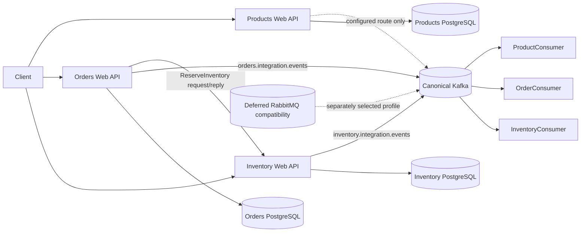

# Distributed Commerce Reconstruction Blueprint

## Purpose

This blueprint describes the target architecture at a precision suitable for implementing it without reading the original product source. It preserves compatible behavior while explicitly adopting the quality uplifts in `reconstructable-system-baseline.md`.

## System Shape

The repository is a micro-system mono-repository containing three bounded contexts. Each context uses Domain, Application, Infrastructure, and Presentation responsibilities interpreted as ports and adapters.

Cross-context arrows represent message contracts, never direct project/domain calls or HTTP collaboration.

## Layer And Dependency Contract

| Layer | Owns | May depend on | Must not depend on |
| --- | --- | --- | --- |
| Domain | aggregates, invariants, value/result objects, domain events | business-neutral Domain BuildingBlocks | Application, Infrastructure, Presentation, BC contracts, database, broker |
| Application | use-case inbound ports, inputs/outputs, query/write/gateway/publisher outbound ports | Domain, Application/Integration BuildingBlocks, Published Language where collaboration is required | concrete Dapper/Npgsql/Wolverine/ASP.NET adapters |
| Infrastructure | repositories, query adapters, gateways, source outbox, relay, broker publishers, DI modules | Application, Domain, BuildingBlocks, contracts, selected packages | Presentation business decisions |
| Presentation | controllers, MQ handlers, host composition, transport DTO mapping, OpenAPI/telemetry | Application and composition-required Infrastructure | domain decisions or direct repository orchestration |

`SharedKernel` remains an empty placeholder until a separately approved shared domain concept exists.

## BuildingBlocks Contract

- `DomainEntity<TId>` owns `Id`, pending `DomainEvents`, `AddDomainEvent`, and `ClearDomainEvents`.
- `AggregateRoot<TId>` adds committed `Version`.
- `EsAggregateRoot<TId>`:
  - replays committed events in order, advancing `Version` once per event and never enqueuing them;
  - applies a new event through deterministic `When` before adding it to pending events;
  - accepts a commit version only when it equals committed version plus pending count;
  - on successful acknowledgement advances the version and clears pending events exactly once;
  - preserves version and pending events on a rejected acknowledgement.
- `IAggregateRepository<TAggregate,TId>` exposes only `FindByIdAsync` and `SaveAsync` for one aggregate.
- `IDomainRepository` is a compatibility alias; new design should prefer the canonical aggregate repository name.
- Query repositories are read-only ports and return DTO/read models.
- `Result<T>` exposes `IsSuccess`, `Value`, `ErrorMessage`, plus `Success`/`Failure` factories for expected business outcomes.
- `IIntegrationEvent` includes `OccurredOn`; `IntegrationMessageDelivery` carries stable `MessageId` and optional `PartitionKey`.

## Bounded Contexts

### Products

- Aggregate: `Product(Guid Id, string Name, string Description, decimal Price, int Version)`.
- Invariants: non-blank name/description, non-negative price.
- Commands: Create, Update, Delete.
- Queries: GetAll, GetById.
- Persistence: state-based PostgreSQL row with optimistic `Version` and `IsDeleted` marker.
- Domain events: ProductCreated, ProductUpdated, ProductDeleted.
- No product integration event is normative yet. Keep the configured route only for compatibility until `DEC-001` is resolved.

### Orders

- Aggregate: event-sourced `Order` with `ProductId`, `ProductName`, `Quantity`, `OrderDate`, `TotalAmount`, `Status`, `Version`.
- Domain events: Placed, Shipped, Delivered, Cancelled.
- Commands: Place, Ship, Deliver, Cancel.
- Query: GetOrderDetails from a read model, not aggregate replay.
- State transitions require reason; repeated target state is a no-op. No unapproved commercial transition matrix exists.
- PlaceOrder creates the pending aggregate, invokes the Inventory MQ gateway, and commits only on a successful response.
- `IOrderEventCommitter` atomically appends stream events, upserts the Orders read model, and inserts integration events into the native source outbox.

### Inventory

- Aggregate: `InventoryItem(Guid Id, Guid ProductId, int Stock)` with exactly one row per product.
- Commands: Initialize, Increase, Decrease, Restock, Reserve.
- Query: GetAvailableQuantity.
- Normal event-producing stock commands load through aggregate/query repositories and commit the mutated aggregate plus producer-created message through `IInventoryStockOutbox` with expected-stock concurrency.
- Reserve uses `IInventoryReservationOutbox`; the use case supplies a successful-message factory while Infrastructure privately owns the local transaction spanning idempotency record, locked stock row, terminal outcome, and outbox row.
- Expected errors are stable codes, including `InventoryItemAlreadyExists`, `InventoryItemNotFound`, `InsufficientStock`/`InventoryIsNotEnough`, `OperationIdRequired`, `ProductIdRequired`, `QuantityMustBePositive`, and `OperationIdentityConflict`.

## Use-Case Execution Contract

Every use case has `I<Operation>UseCase`, `<Operation>UseCase`, transport-neutral Input/Output, and `ExecuteAsync(..., CancellationToken)`. Controllers inject interfaces directly. A framework handler exists only for a real MQ delivery and maps one message to exactly one use case.

Commands change one aggregate by default. Cross-context effects use message contracts. Query use cases read through an Application-owned query port and return DTOs/read models.

## Persistence And Delivery Boundaries

### Products

Use parameterized Dapper SQL. Insert at version 1. Update/delete only where ID, current version, and non-deleted state match. Zero affected rows means optimistic concurrency conflict. Reads filter `IsDeleted=false`.

### Orders

The stream identity is Order ID. Stream versions are contiguous integers starting at 1 and unique per stream. One local transaction writes all pending events, outgoing integration events, and the current Orders projection. Commit transaction, acknowledge aggregate changes, then dispatch local domain events.

The source outbox relay leases eligible rows, publishes with stable row ID and aggregate partition key, then deletes on success. Failure increments attempts, schedules bounded backoff, records a privacy-safe error summary, and parks after five failures. A publish-before-delete crash may redeliver; at-least-once is normative.

### Inventory

Inventory commands that emit integration events use `IInventoryStockOutbox`, not direct publish-after-save. The Application use case loads and mutates one `InventoryItem`, creates the producer-owned event plus delivery metadata, and passes the mutated aggregate, expected pre-mutation stock, and message to the port. The PostgreSQL adapter updates with `WHERE Id = @Id AND Stock = @ExpectedStock`, inserts `InventoryIntegrationOutbox`, and commits once; zero updated rows is an optimistic-concurrency failure. Local database transaction/UoW types stay private to Infrastructure.

`ReserveInventoryUseCase` calls `IInventoryReservationOutbox.ReserveAndStageAsync` with a producer-owned successful-message factory. The adapter inserts/claims `OperationId`, locks the product inventory row, calculates and stores the terminal outcome, invokes the factory only on success, stages `ProductStockDecreasedIntegrationEvent`, and commits once. Existing operation with identical payload returns the stored outcome and reuses the outbox row; payload mismatch returns conflict without mutation. A generic Application `IUnitOfWork` is intentionally absent because the current invariant spans one aggregate/capability plus its outbox, not multiple aggregates.

The Inventory relay leases unpublished rows, deserializes decrease/increase/return events, publishes with the stored message ID and `PartitionKey = ProductId.ToString("N")`, and sets `PublishedAt`. Reservation message ID equals `OperationId`; other stock commands generate UUID v7. Failures back off per row and park after five attempts. `Messaging:OutboxRelay:Retention:Mode=RetainAll` is the default; `PublishedForDays` plus a positive `PublishedRetentionDays` explicitly enables pruning only of published rows. A publish-before-mark crash may redeliver; at-least-once remains normative.

Kafka remains the current single canonical destination. Kafka + RabbitMQ dual broadcast is the owner-selected target direction, not a current runtime claim. Before enabling it, replace the single-row `PublishedAt` completion model with per-destination delivery records so Kafka and RabbitMQ can retry, park, and complete independently; configure RabbitMQ as exchange plus one queue per independent consumer.

## Runtime Composition

All hosts consume the shared `Messaging` section:

- `Profile`: exactly `InMemory`, `Kafka`, or `RabbitMq`;
- Kafka is canonical and requires `Messaging:Kafka:ConnectionString`; producer-selected partition keys scope ordering, and distinct consumer groups provide independent topic delivery;
- RabbitMQ is a compatibility profile and requires an absolute `amqp` or `amqps` URI at `Messaging:RabbitMq:ConnectionString`; current shared queues are not a broadcast design, and dual broadcast remains unimplemented until destination-aware outbox state and fanout routing exist;
- Inventory published-row retention is adjusted only at `Messaging:OutboxRelay:Retention:Mode` and `Messaging:OutboxRelay:Retention:PublishedRetentionDays`;
- external profiles require the host-specific PostgreSQL connection string when Wolverine persistence is used;
- InMemory stubs external transports and must not require broker/database persistence solely for message delivery.

API hosts enable controllers, OpenAPI + Scalar in Development, HTTPS redirection, authorization middleware, explicit Application/Infrastructure registrations, and OpenTelemetry. Consumers are Generic Hosts with broker listener topology and telemetry.

## Public Contract Placement

- HTTP adapter specs: `http-api-contracts.json` and domain adapter files.
- MQ schema and delivery: `message-contracts.json`.
- database schemas and atomicity: `persistence-contracts.json`.
- host/profile/topology: `runtime-contracts.json`.
- domain behavior: `../domains/`.
- verification: `coverage-matrix.md`, problem frames, and `../tests/`.

## Build Order

1. Domain BuildingBlocks.
2. Application and Integration BuildingBlocks.
3. BC contract projects.
4. Each bounded-context Domain project.
5. Each bounded-context Application project.
6. Each bounded-context Infrastructure project.
7. Six Presentation hosts.
8. Five test projects, including an independently owned Inventory test surface; external-service checks are opt-in and skipped by default.
9. Solution grouping, Dockerfiles, Compose, SQL/migrations, and validation scripts.

The exact project identities are in `project-manifest.json`.

## Quality-Uplift Decisions For Reconstruction

- Apply positive/non-negative quantity and stock validation from `INV-003` even where the current implementation is incomplete.
- Use the shared `MessagingTransportOptions` contract in Product hosts instead of legacy environment-name branching.
- Give known not-found and validation outcomes explicit adapter mappings instead of allowing unhandled exceptions to define the HTTP contract.
- Add Inventory domain/application/persistence/reservation tests.
- Use owner-approved `IncreasedQuantity` and `ReturnedQuantity` serialized names; do not retain the prior erroneous `DecreasedQuantity` aliases.
- Preserve every Accepted ADR behavior and add failure-injection coverage for transaction/outbox boundaries.

## Non-Goals And Deferred Decisions

- Do not invent Product integration events.
- Do not invent business meaning for consumer subscriptions that have no handler map.
- Do not introduce distributed transactions.
- Do not place broker/database/framework types in Domain or portable use-case contracts.
- Do not claim Kafka + RabbitMQ dual delivery until destination-aware delivery state, exchange/per-consumer queues, routing tests, and runtime evidence pass; the target direction alone is not implementation evidence.
- Do not apply source outbox to `InitProductStock` unless a producer-owned outgoing event is first specified; it currently emits none.
- Never delete original source as part of reconstruction validation. Create source-free disposable copies; original-source deletion is repository-owner-only.
