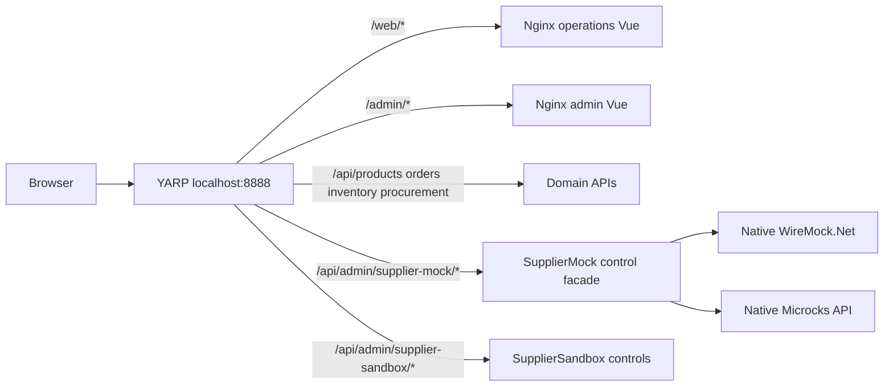

# Frontend architecture and design decisions

created_at: 2026-09-26T06:15:44+00:00; updated_at: 2026-09-26T06:15:44+00:00

Baseline: 8213a9e. Issue18 / AC01–AC06. Source: owner request and requirements.md. These choices are authorized implementation design, not proof of execution.

Owner clarification v2: ordinary users are internal sales/warehouse staff. `/web` owns daily stock/procurement/receiving and sales-order work; `/admin` owns product master maintenance and developer/maintenance tools. The original storefront proposal is retained in design-history.

## Boundaries

- `src/Frontend/Web`: standalone Vue3 + TypeScript + Vite application, Vue Router, npm lock, its own Dockerfile and Nginx config. Public base `/web/`.
- `src/Frontend/Admin`: same stack and shared visual vocabulary, independent build/lock/container. Base `/admin/`.
- No cross-app runtime dependency or prematurely shared package. Their small API/error/design primitives may duplicate; independent worktrees/builds keep ownership clear. No React/Angular mixing.
- Existing domain APIs remain business authorities. Frontends are HTTP adapters; no direct DB/broker access, automatic mutation retries, or duplicated domain state machine.
- Existing SupplierMock.WebApi gets a bounded Microcks control adapter under `/control/microcks`, fixed configured upstream and three packaged YAML artifacts only. Existing WireMock controls retain behavior.
- YARP remains `ghcr.io/yuchia-wei/yarp-gateway:v0.0.5`; add frontend clusters/routes and bounded management routes. Keep existing API routes compatible.

## Deployment and compatibility

Add `docker-compose/docker-compose.frontend.yml` applied after base and procurement overlays, profile `frontend-lab`; Nginx services `web-frontend` and `admin-frontend` expose 80 only on the Docker network. YARP maps 127.0.0.1:8888:8080 in this profile. Existing APIs and native vendor ports remain available for diagnosis. Route paths are `/api/products`, `/api/orders`, `/api/inventory`, `/api/procurement` (the owner's domain is a placeholder). Management prefixes remove only `/api/admin/supplier-mock` or `/api/admin/supplier-sandbox`; frontend prefixes remain intact to Nginx. `/web` and `/admin` canonicalize to trailing slash. Do not route an unknown API to a SPA fallback.

Use `mqarchlab-pr5-integration` with existing data/volumes, never compose down -v or prune. Preserve ai-collaboration-observability entirely. Bring up only needed commerce services. Build/node temp artifacts may use F:. Before archiving F: worktrees after merge, redeploy any worktree-based bind mounts/build references from durable primary main and verify entrypoints again.

## Visual direction

Taiwan Traditional Chinese. Brand `Commerce Lab` / `商務實驗室`. Web: warm off-white (#f6f7f9), navy text (#172033), emerald primary (#176b57), restrained amber accent; generous typography, compact sidebar, task shortcuts, searchable product tables and focused operation forms, purposeful empty states. Admin: navy slim sidebar with emerald active state, light workspace, dense but readable tables, breadcrumbs/page title, status pills, bordered forms/drawers. System font Segoe UI/Noto Sans TC fallback; no remote fonts or stock-photo dependency. Icons via local SVG or selected small open-source icon package. No emoji used as primary navigation icons.

Meaningful UI: actual counts only, no fabricated analytics; no charts without data. Provide discoverable front/admin switch. At 390px, collapsible nav, stacked forms/cards, table overflow confined to table container; no horizontal page scroll. Product names and server errors rendered as text, never v-html. Accessible labels, focus styles, alert/status semantics, disabled busy controls, numeric/UUID validation before mutation. Nginx caches hashed assets, not entry HTML; missing assets return 404.

Alternatives: React/Angular are viable but Vue SFC/Composition API is a small fit for this CRUD/operations lab. One shared SPA could reuse code but couples deployment/routing bundles; two small applications better express distinct operations/maintenance navigation without a new framework/platform. Native vendor UI alone would not meet the integrated admin goal, so build bounded controls and retain native Microcks for advanced independent inspection.
